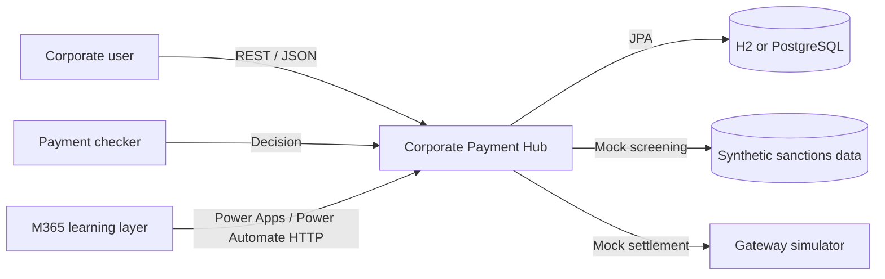
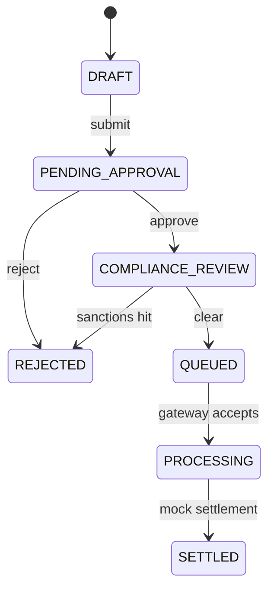
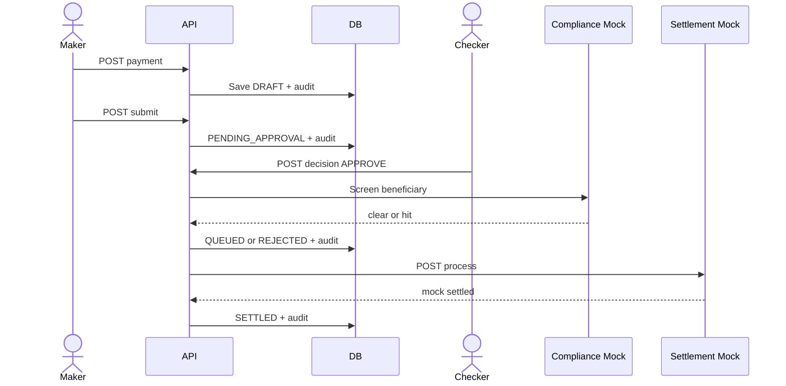

# Architecture and two-dimensional metafield maps

## System context


## Metafield map
```text
ACTOR        CHANNEL       COMMAND       DOMAIN          CONTROL          STATE          EVIDENCE
Maker   ->   REST/M365 ->  Create    -> Payment      -> Validation   -> Draft       -> Audit
Maker   ->   REST/M365 ->  Submit    -> Workflow     -> State gate   -> Pending     -> Audit
Checker ->   REST/M365 ->  Decide    -> Approval     -> Maker-checker-> Approved    -> Approval
System  ->   Internal  ->  Screen    -> Compliance   -> Mock match   -> Queue/Reject-> Audit
Gateway ->   Internal  ->  Process   -> Settlement   -> State gate   -> Settled      -> Audit
```

## Payment state line


## Sequence


## Design decisions
- Modular monolith first: easier to learn and test, while preserving bounded domain areas.
- Finite-state workflow: makes invalid transitions explicit.
- H2 plus PostgreSQL: rapid learning locally and realistic persistence with Docker.
- REST interfaces: suitable for Power Apps/Power Automate integration and later service decomposition.

